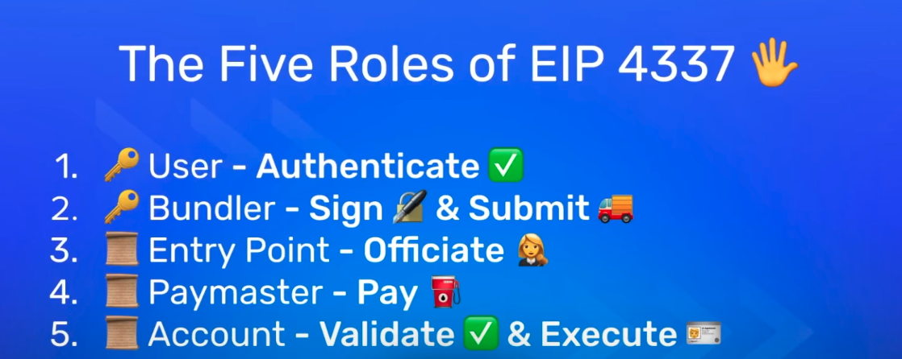
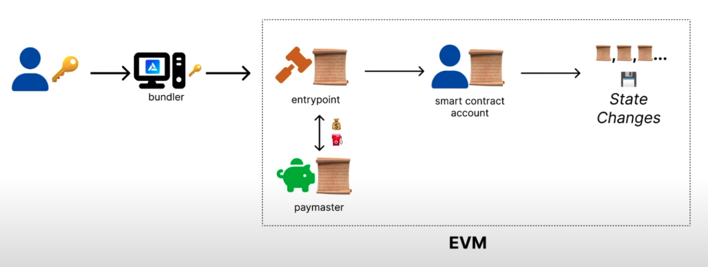

# ERC 4337

## The five roles of ERC 4337
1. User
2. Bundler
3. Entry Point
4. Paymaster
5. Smart Contract Account

- User authenticates the transaction
- Bundler will sign and submit this transaction 
- Entry point will calculate how much gas this transaction will cost and check whether paymaster has the required gas.
  - If the paymaster has required gas, tx will go through
  - If the paymaster dosen't have enough gas, then
  - Entry point will interact with the account and will subtract the accounts balance
- Paymaster will pay the gas (sponsor)
- Account will validate and execute the transaction

